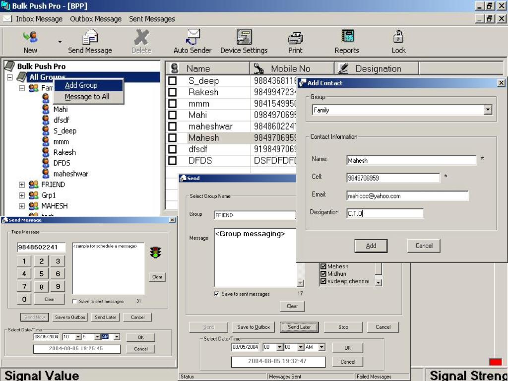



## Bulk SMS

### Description

I searched on internet for a Bulk SMS application on GSM wavecom modem, but found only few and that commercial softwares. So started making my own Bulk SMS application. Fine even this is a version a lot of bugs. But hope it is some what useful to the one who are starting Bulk SMS application. I am thankful to Rajinikanth for giving good sample to send SMS using "SMS Thru GSM Modem "
 
### More Info
 
Using MSComm,Microsoft Access,WaveCom modem.

Good GUI with and userfriendly interface.

Hi guyz a best Bulk SMS application with Outlook simulating features, maintaining phone book and faster messaging.

Inform me if any :)

             |
---                |---
**Submitted On**   |2004-12-13 18:26:12
**By**             |[m A h E s H k U m A r](https://github.com/Planet-Source-Code/PSCIndex/blob/master/ByAuthor/m-a-h-e-s-h-k-u-m-a-r.md)
**Level**          |Intermediate
**User Rating**    |4.7 (70 globes from 15 users)
**Compatibility**  |VB 6\.0
**Category**       |[Complete Applications](https://github.com/Planet-Source-Code/PSCIndex/blob/master/ByCategory/complete-applications__1-27.md)
**World**          |[Visual Basic](https://github.com/Planet-Source-Code/PSCIndex/blob/master/ByWorld/visual-basic.md)
**Archive File**   |[Bulk\_SMS18292112142004\.zip](https://github.com/Planet-Source-Code/m-a-h-e-s-h-k-u-m-a-r-bulk-sms__1-57670/archive/master.zip)

### API Declarations

:-?

